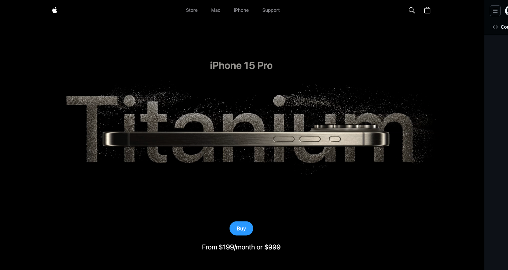

# **Apple iPhone 15 Pro Clone with GSAP and Three.js** 🔥  
Create a visually stunning app that mirrors Apple's premium product design and functionality.  

  

## [Live Demo: 3D Apple iPhone 15 Website](https://mb-iphone-clone.netlify.app/)  

### **Inspiration**  
This project draws inspiration from the incredible work of [JavaScript Mastery](https://www.youtube.com/@javascriptmastery).  

---

## **Features**  
- **Custom Animations**  
  - Scroll-triggered effects, staggered animations, and timeline control.  
- **Interactive Video Slider**  
  - Progress tracking with smooth transitions.  
- **3D Model Integration**  
  - Animated models featuring various configurations, lighting setups, and dynamic viewports.  

---

## **Fully Responsive Design**  
Built to deliver seamless performance and aesthetics across all devices.  
